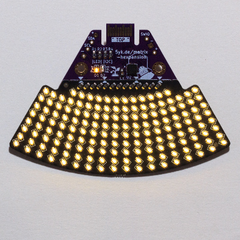
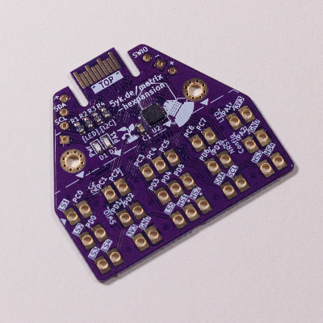

# Matrix Hexpansion

This repository contains the firmware and hardware projects for the **Matrix Hexpansion** and the CH32V006 breakout hexpansion it is based on. This is an add-on for the EMF Camp Tildagon/Spaceagon [badge](https://tildagon.badge.emfcamp.org/).



The hexpansion can be controlled with the [Matrix Hexpansion companion app](https://github.com/kristianhentschel/tildagon-matrix-hexpansion-app). The processor refreshes the LED Matrix using DMA (up to 156 LEDs with charlieplexing on its 13 available GPIO pins) and can run animated patterns or scrolling text configured by the badge over the I2C interface.

Assembled hexpansions will be available to buy from [shop.alwaysplottingsomething.com](https://shop.alwaysplottingsomething.com/category/hexpansions).

Note that the LEDs are only a single colour, and not as bright as the WS2812B/NeoPixel-style RGB LEDs seen on other hexpansions. On the other hand, you can have multiple of these plugged in without running down your battery in minutes!

## Base CH32V006 prototyping hexpansion



The common base board with the hexpansion connector must be produced with ENIG finish and holds the processor, status LEDs, configuration jumpers, and I2C pull-up resistors. It has large through hole pads for all GPIO pins and Hexpansion connector pins for a daughter board to connect to. There are also debug pads for I2C, power, and a USB programmer like the WCH LinkE.

I use the CH32V006F8U6/7 processor and program it with the [ch32fun framework](https://github.com/cnlohr/ch32fun). The CH32V003F4U6 has the same pinout and footprint, but may not have enough flash and RAM to run the matrix, control interface, and animation. If you get an assembled board from me, the processor is already programmed with a bootloader so firmware programs can be flashed from the badge without buying the dedicated USB debugger.

There is no dedicated EEPROM on the board, but the microcontroller is connected to the I2C bus and can emulate a read-only EEPROM interface if desired.

## Daughter board

Daughter boards are soldered to the base's pads, usually with SMD pads on the bottom. They can be cheaper to manufacture at low quantities (e.g. use HASL finish). The `lite-loop` board used in the Matrix Hexpansion is an example.

## Hardware

The `boards` directory contains KiCad projects and schematics for the PCBs.

* `base_v2_lite`: The base hexpansion board; with a CH32V006 co-processor and all GPIO pins and hexpansion interface pins broken out to through-hole pads.
* `lite_loop`: The 156-LED matrix display daughter board (13 pin charlie-plexing, arranged in 8 rows of 18 columns and a 9th row of 12 columns). Six instances of this make a circle surrounding the badge.

There is also a symbol library and footprints to aid in making custom daughter boards.

## Firmware

The RISC-V CH32V006 processor on the base board runs native firmware code built with the [ch32fun framework](https://github.com/cnlohr/ch32fun).

* `firmware/lite_loop` is the driver for the `lite-loop` daughter board. It maintains the LED matrix display, can run animations and scrolling text patterns, and presents an I2C interface for identifying and controlling the hexpansion from the badge.
* `firmware/bootloader_006` presents an I2C EEPROM-like interface if the `PD7` pin is pulled low during boot, so the badge can write the (non-bootloader) code flash area to replace the main program with a new firmware image.
* `firmware/blink` is a very small hello-world program that just toggles the PA1 pin attached to the status LED. It is useful when bulk provisioning or as a starting point for using the base without the lite-loop daughter board.

### Developing custom firmware

You can use the badge app to upload your own firmware program to the microcontroller on the hexpansion, for example to write your own animated patterns. To get set up you will need a few things:

1. A RISC-V toolchain, see instructions at https://github.com/cnlohr/ch32fun/wiki/Installation (building their `minichlink` and getting a USB debugger is optional as we will be using the badge to upload our firmware image).
2. A way to upload files to the badge over the USB connection, such as [mpremote](https://docs.micropython.org/en/latest/reference/mpremote.html) or [Thonny](https://thonny.org/).
3. The ["Matrix Hexpansion" app](https://apps.badge.emfcamp.org/apps/41214133), from the Tildagon app store.

Then follow these steps to upload firmware using the badge app:

1. Compile the firmware image
2. Copy the firmware image `.bin` file to the "Matrix Hexpansion" app's `assets/` folder
3. Reboop the badge
4. Open the app, and select "Firmware Upgrade", the target hexpansion slot, and your custom image.

```sh
# get the ch32fun repository
git submodule update --init --recursive

# make a copy of the lite-loop firmware to start from
cd firmware
cp -r lite_loop my_firmware

# build your firmware binary
cd my_firmware
make build

# copy the firmware image to the badge file system
mpremote cp main.bin :/apps/kristianhentschel_tildagon_matrix_hexpansion_app/assets/my_firmware.bin
```

To get started, place this code at the top of the `loop()` function in `my_firmware/main.c`:

```c
// void loop() {
  while(true) {
    for (int frame = 0; frame < 2 * LEDS_GRID_COLS; frame++) {
      for (int row = 0; row < LEDS_GRID_ROWS; row++) {
        for (int col = 0; col < LEDS_GRID_COLS; col++) {
          // Find the frame buffer index of the LED at the current row and column:
          int index = leds_grid_indices[row * LEDS_GRID_COLS + col];
          // In the array of grid indices some values are 255, because the first row only has 12 LEDs instead of 18, so skip those:
          if (index >= LEDS_COUNT) continue;
          
          // Set the LED to on or off depending on the current frame
          if (frame < LEDS_GRID_COLS) {
            frame_buffer[index] = col < frame ? 255 : 0;
          } else {
            frame_buffer[index] = col >= frame - LEDS_GRID_COLS ? 255 : 0;
          }
        }
      }

      Delay_Ms(40);
    }
  }

  // ... existing loop code, unreachable
// }
```

You may also wish to change the name in the hexpansion header; this will stop the app attempting to control it. Replace the `friendly_name` value in the hexpansion header (it must still be at most 9 characters; fill any extra slots with `0`):

```c
// static hexpansion_header_t g_hexpansion_header = {
  // ...
  // .friendly_name = {'L', 'i', 't', 'e', 'l', 'o', 'o', 'p', 0},
  .friendly_name = {'M', 'y', ' ', 'M', 'a', 't', 'r', 'i', 'x'},
// };
```

You can use the defined LED positions in [leds.h]() (using the `leds_polar_positions` and `leds_grid_indices` variables); or you could add to the list of animations, keep the name, and modify the badge app to trigger them.

Note this is all still somewhat of a prototype, for example I may change the position values to an integer representation, or come up with a system for the app to discover custom patterns to make this easier in future versions. It would also be nice to synchronise animations across multiple hexpansions.

### Bootloader and provisioning

To provision a factory-fresh processor, the bootloader must first be flashed and configured using a dedicated programmer like the WCH-LinkE and the ch32fun `minichlink` tool. We must flash the flash bootloader, configure PD7 use as GPIO rather than reset, and flash a main program. I use the `blink` program during provisioning because it is quick to build and upload; the lite_loop program is then flashed from the badge during testing. The `provision.sh` script does these steps, optionally in a loop:

```sh
./provision.sh --app blink --bootloader --loop
```
For end users, firmware updates can be applied from the badge app and a dedicated programmer is not required (but may still be helpful for debugging if writing your own firmware).

## Note on previous iteration

The base is called `v2` because the first iteration of this also had a [IS31FL3731](https://lumissil.com/assets/pdf/core/IS31FL3731_DS.pdf) LED driver, but this was found to add unnecessary cost and complexity and was never assembled or programmed properly. I suspect it would be able to drive the LED's quite a bit more brightly and consistently! In the current `v2` the current limiting resistors were moved to the daughter board and the breakout pads have a more useful generic layout, also including the hexpansion connector pins.